# Aap Ka Vaidya - Swaasth ek Jaroorat

=> A flutter android application for Easy interaction between patient's and doctors. During pandemic many of the patients are looking to get a regular health check-ups but due lockdowns this seems impossible.

=> So the application is build for this problem, it consists of chatbox(static) , login/signup page, cool animations, covid tracker using webview, also addon to this there is a relax zone which comprises of Games and Music,

=> The app uses YouTube API to call the videoplayer to get indulge in streaming youtube videos there, nearby locations is also set using Google Map API.

## Getting Started

### To run the application on your local machine:
  
=> Open your Git Bash command window and in the root directory type the following commands:

    1) git init -initializes the git repository from the GitHub. 
    2) git clone -Clone the repository to your local machine
=> Open your Android IDE:

    1) Open the file at the root directory
    2) Code your modifications in the project

### Some useful links to learn flutter:

- [Lab: Write your first Flutter app](https://flutter.dev/docs/get-started/codelab)
- [Cookbook: Useful Flutter samples](https://flutter.dev/docs/cookbook)

For help getting started with Flutter, view our
[online documentation](https://flutter.dev/docs), which offers tutorials,
samples, guidance on mobile development, and a full API reference.

## Screenshots

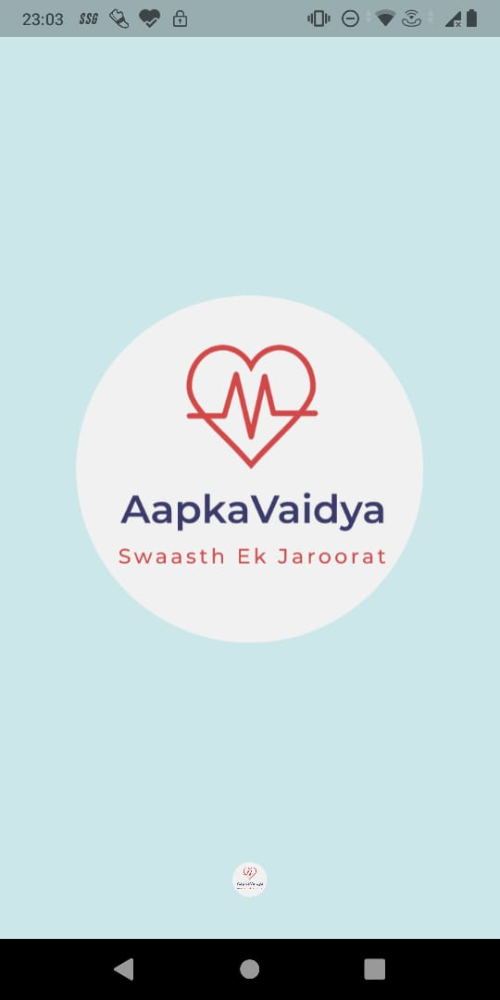  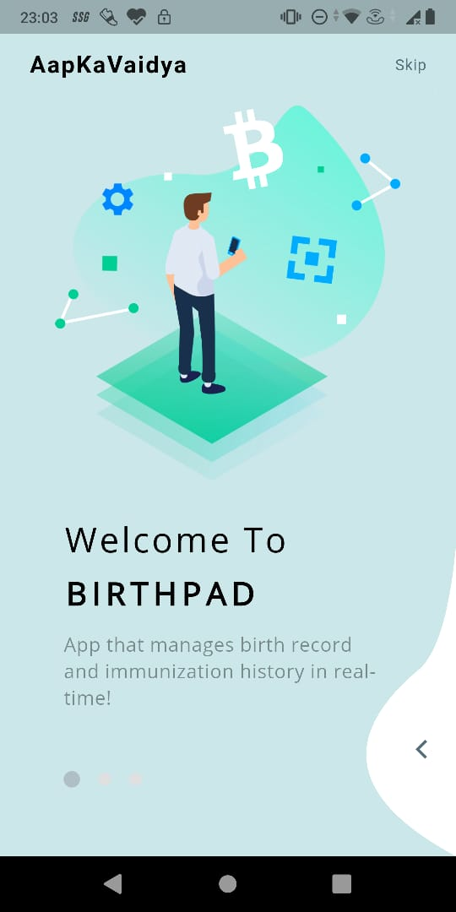  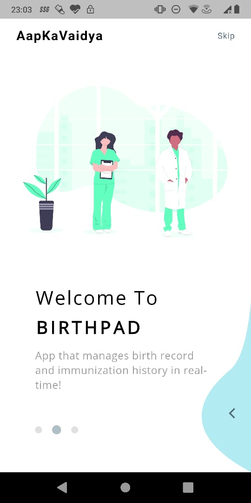

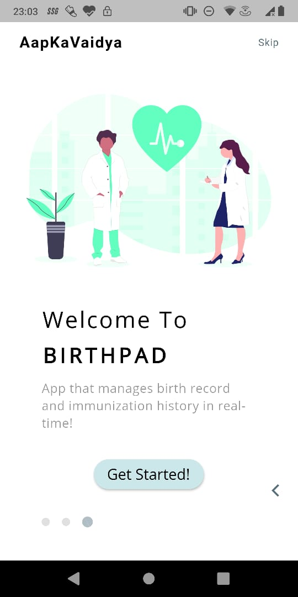  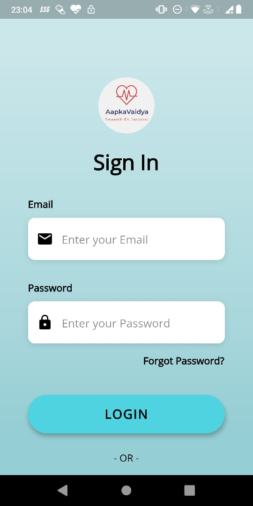  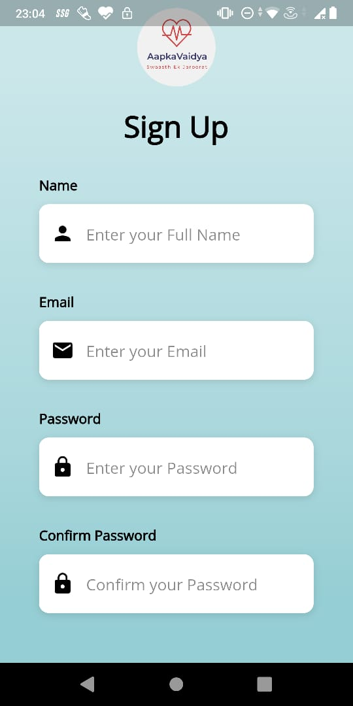

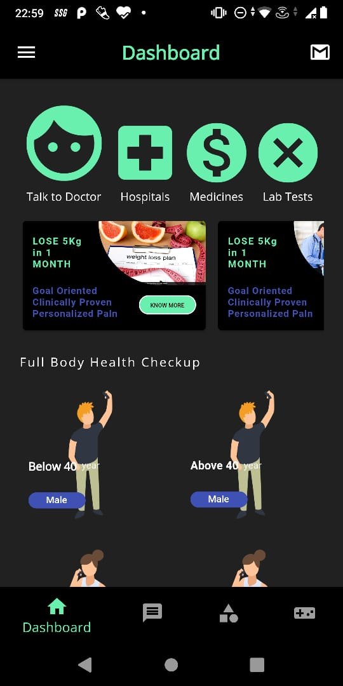  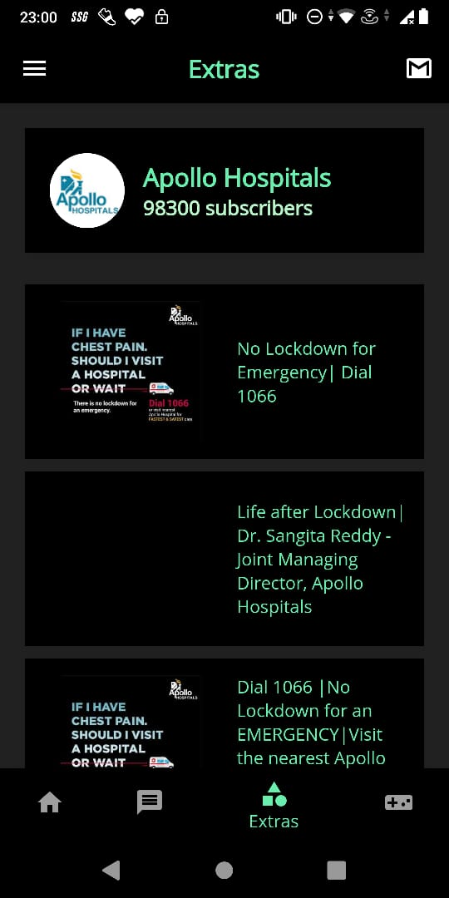  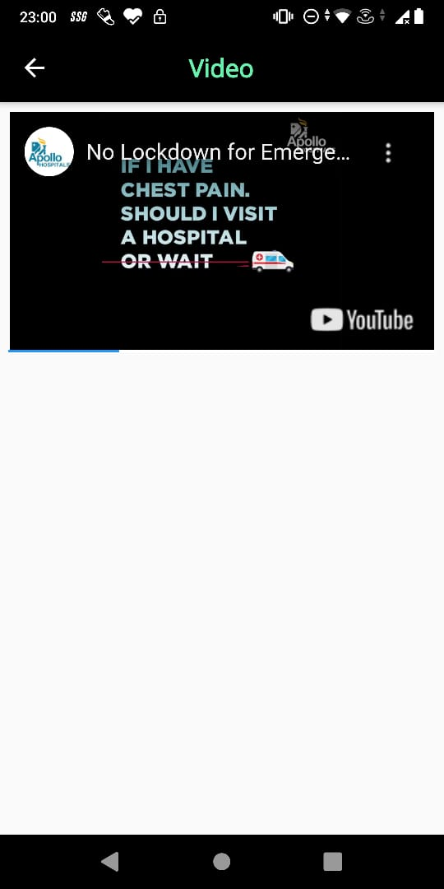

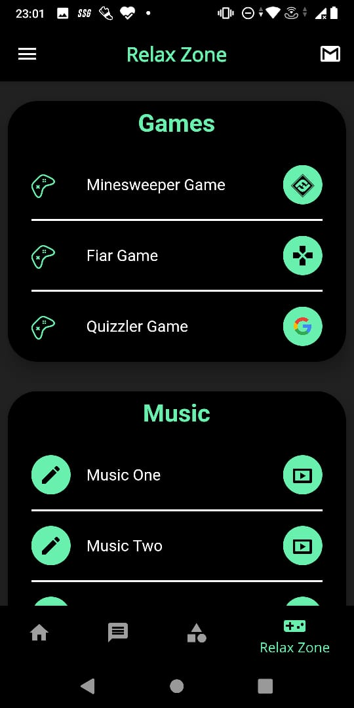  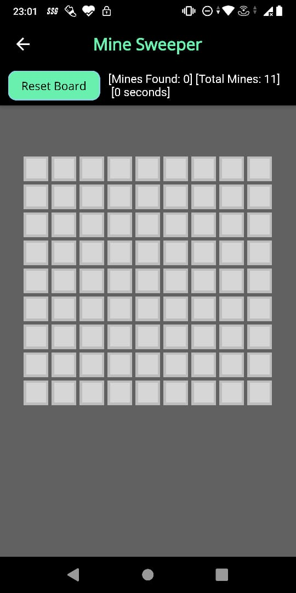  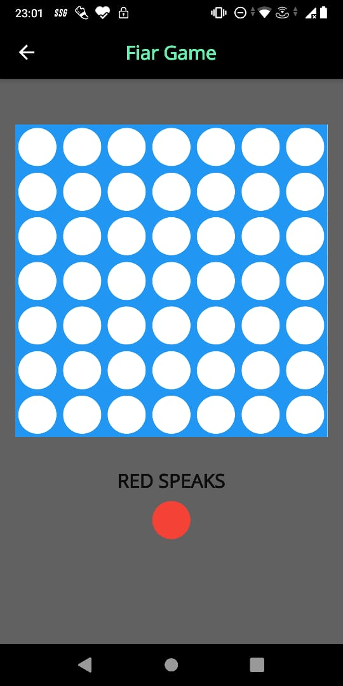

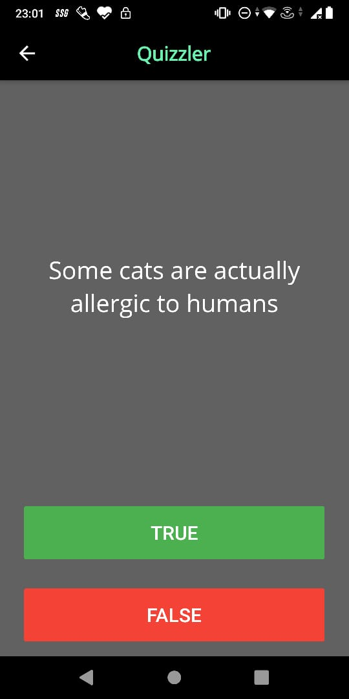  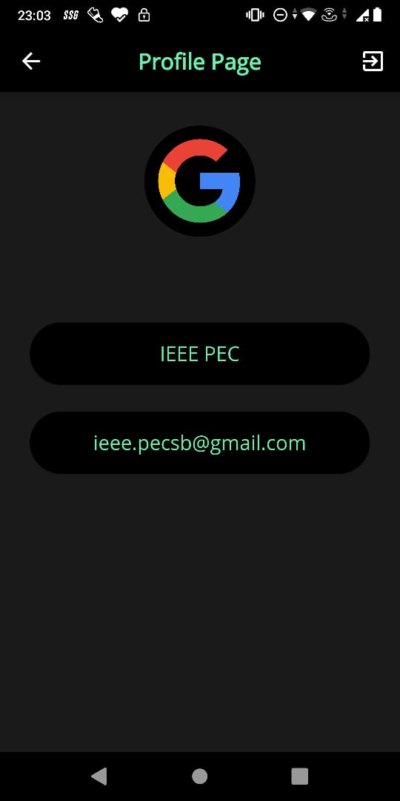  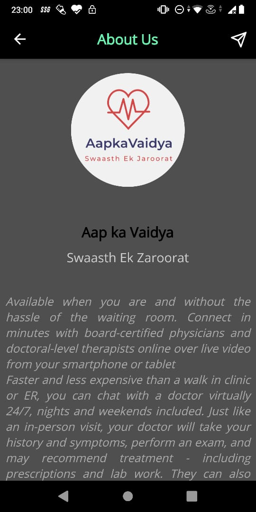

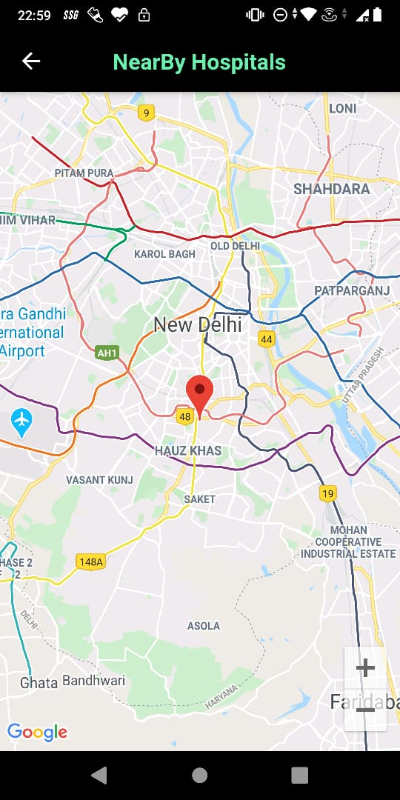  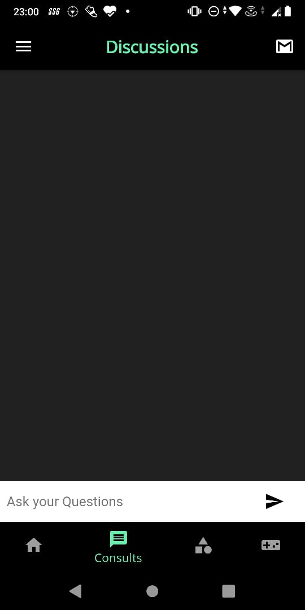  

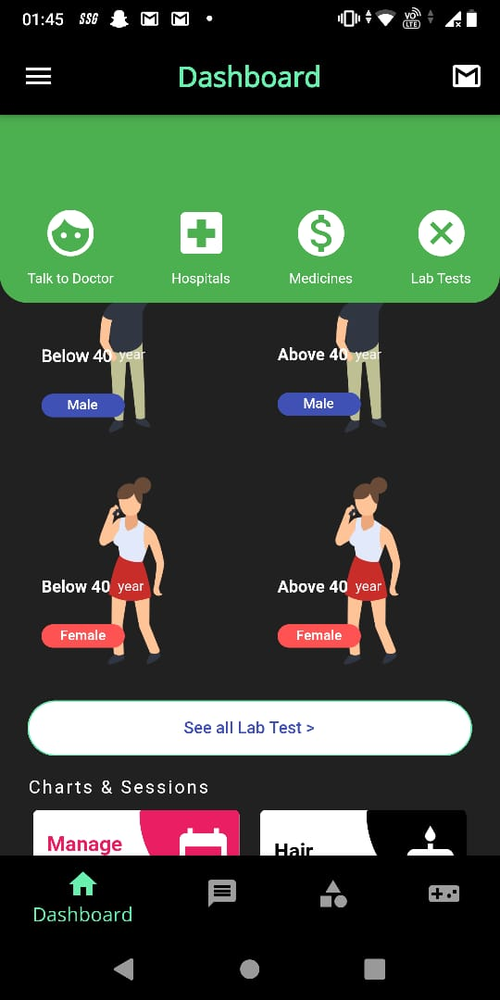  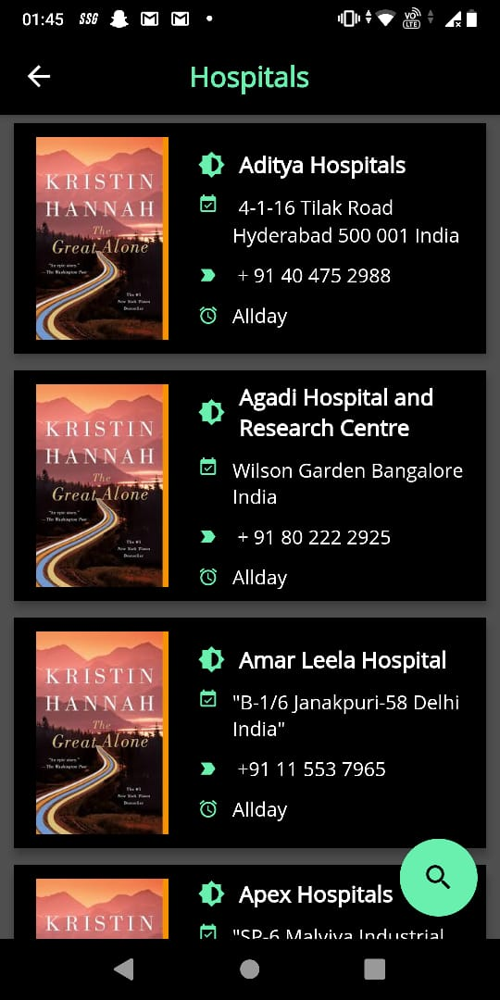  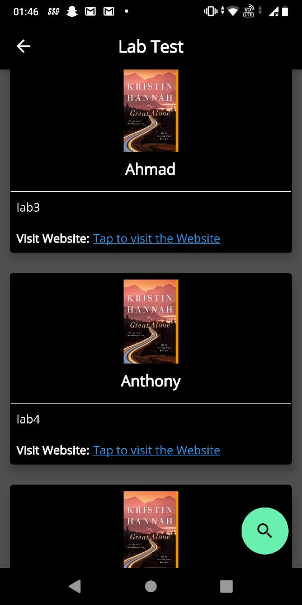

## Download our app from the link below:

[Google Drive](https://drive.google.com/file/d/1YFlJbIxzckjHmrvzxY3ist3d6MX3qSzT/view?usp=sharing)

## Link for the Video Demo

[Google Drive](https://drive.google.com/file/d/1O_G5BGP7VAbwcal1Hj8ZJkXe4NjBQ_Mp/view?usp=sharing)
